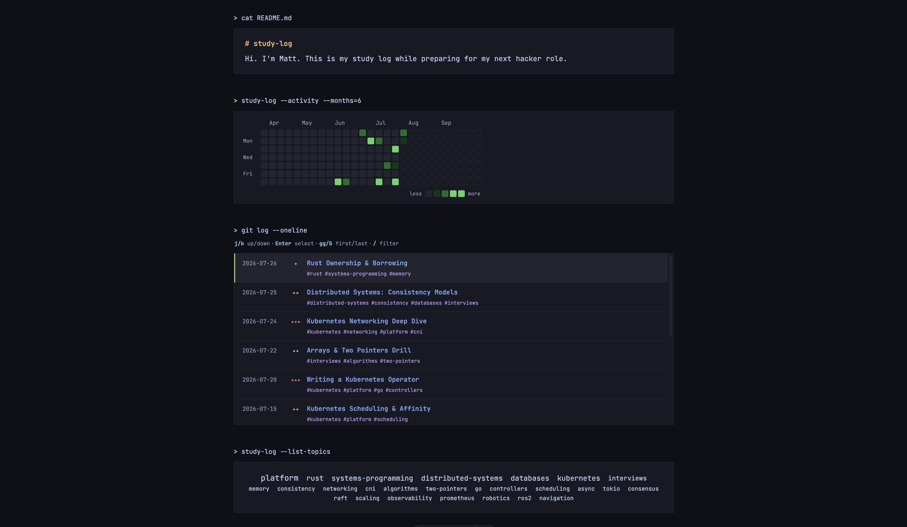

<div align="center">

# 📓 study-log

This is my **study log** while preparing for my next hacking position. It serves two purposes:

(1) Make myself describe and spell out what I learned ([Feynman Technique](https://fs.blog/feynman-technique/)).  
(2) Showcase to my future fellow team mates that I am serios - bra.



</div>

## How it works
Commit a Markdown file. Get a glorious [vim](https://www.vim.org/)/[GitHub](https://github.com/matthaeusheer)-styled study log.

## Running it

Prerequisites: Node 20+.

```bash
git clone https://github.com/matthaeusheer/study-log.git
cd study-log/site
npm install
npm run dev
```

Then open [http://localhost:4321](http://localhost:4321).

## Deploying it

I host it on Vercel. The Astro project sits in `site/`, so the `vercel.json` at
the repo root handles the build. Five steps to stand up your own:

1. **Import** the repo at [vercel.com/new](https://vercel.com/new) — it reads `vercel.json`, so Framework/build settings come out right. Hit **Deploy**. You get a live URL and auto-deploys on every push.
2. **Create a Deploy Hook** in Vercel → *Settings → Git → Deploy Hooks* (branch `main`). Copy the URL.
3. **Add it as a GitHub secret** named `VERCEL_DEPLOY_HOOK` (repo → *Settings → Secrets and variables → Actions*).
4. The included workflow (`.github/workflows/daily-rebuild.yml`) then pings that hook once a day — needed because the activity grid's "today" is baked in at build time and would otherwise go stale.
5. **Test it** from the *Actions* tab → *Daily rebuild* → *Run workflow*, and watch a fresh deploy show up in Vercel.

## Adding an entry

Drop a `YYYY-MM-DD-slug.md` file in `entries/` with some frontmatter:

```markdown
---
title: "Kubernetes Networking Deep Dive"
date: 2026-07-24
tags: [kubernetes, networking, platform]
depth: deep          # quick-read | solid | deep | repetition
summary: "One line on what actually clicked."
links:
  - label: "CNI Spec"
    url: "https://github.com/containernetworking/cni/blob/main/SPEC.md"
---

## What I studied
...
```

The `depth` field is what feeds the heatmap: `quick-read` (1), `repetition` (2),
`solid` (3), `deep` (5). Same-day entries stack.

## Tech Stack

Astro 7 (static), Markdown content collections, hand-rolled CSS, TypeScript.
Meant for Netlify/Vercel — I'll wire up hosting and a daily rebuild once it settles.

## Notes

- Commits follow [Conventional Commits](https://www.conventionalcommits.org/),
  enforced locally with commitlint + husky (`npm install` at the root sets up the hook).
- The full spec — layout, grid scoring, keyboard nav, colour choices — lives in
  [`docs/spec.md`](./docs/spec.md) if you're curious how it's put together.

## Contributors
* [Matthäus Heer](https://github.com/matthaeusheer)
